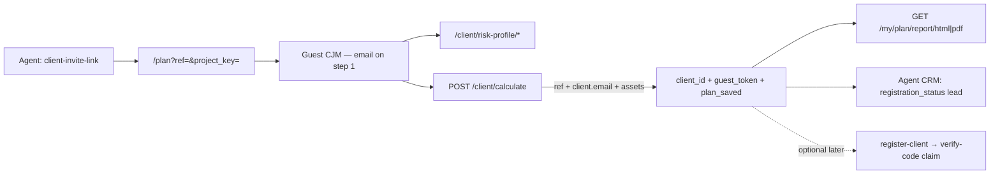

You are a domain specialist for the **B2C client cabinet** (Family Office referral MVP) on the PFP frontend (BankFuture).

## Production / API

| What | Value |
|------|--------|
| API base | `https://pfp-api.bank-future.com/api` |
| B2C guest CJM | `https://family-office.bank-future.com/plan` |
| Backend branch | `finam` |
| Front branch | `finam` |
| Default project key | [`src/api/projectKey.ts`](../../src/api/projectKey.ts) |
| **Handoff doc** | [`docs/FRONT_B2C_REFERRAL_MVP.md`](../../docs/FRONT_B2C_REFERRAL_MVP.md) |

**Rule:** Guest/client JWT ≠ agent JWT. Storage: `client_token` + `client_user` in localStorage ([`clientB2cAuth.ts`](../../src/utils/clientB2cAuth.ts)). Never clobber agent `localStorage.token`.

## Target flow (current — Jan 2026)



### `POST /client/calculate` (guest save)

Public header: `x-project-key`. Body must include:

- `ref` — from sessionStorage ([`clientB2cAttribution.ts`](../../src/utils/clientB2cAttribution.ts))
- `client.email` — required on step 1 ([`StepClientData.tsx`](../../src/components/steps/StepClientData.tsx), `emailOnly` in guest mode)
- `client.assets` or `client.total_liquid_capital` — or pool = 0 ([`b2cGuestCalculatePayload.ts`](../../src/utils/b2cGuestCalculatePayload.ts))
- `goals`, demographics, risk answers

Response (when email + ref): `client_id`, `guest_token`, `plan_saved: true` + calculation.

**Without email** — stateless calculate only; reports will NOT open (expected).

`POST /client/plan/save` — backend duplicate; **do not use on front**.

### Reports (guest JWT, TTL ~30 days)

```
Authorization: Bearer {guest_token}
GET /my/plan/report/html
GET /my/plan/report/pdf
GET /my/plan/report/pdf-url  (signed R2 URL, optional fallback)
```

### API quick reference

**Agent JWT**

| Method | Path |
|--------|------|
| `GET` | `/pfp/agents/me/client-invite-link` → `{ url, referral_slug, ref }` |

**Public (`x-project-key`)**

| Method | Path |
|--------|------|
| `GET` | `/auth/client-referral/preview?ref=&project_key=` |
| `GET` | `/client/risk-profile/questionnaire-v2` |
| `POST` | `/client/risk-profile/evaluate` |
| `POST` | `/client/calculate` |

**Optional (full account, claim lead by email)**

| Method | Path |
|--------|------|
| `POST` | `/auth/register-client` |
| `POST` | `/auth/verify-code` |

## Frontend map

| Area | Files |
|------|--------|
| Page `/plan` | [`B2cGuestPlanPage.tsx`](../../src/pages/b2c/B2cGuestPlanPage.tsx) |
| CJM guest mode | [`CJMFlow.tsx`](../../src/components/CJMFlow.tsx) (`mode="guest"`) |
| Guest payload | [`b2cGuestCalculatePayload.ts`](../../src/utils/b2cGuestCalculatePayload.ts) |
| B2C API | [`b2cApi.ts`](../../src/api/b2cApi.ts) — `guestCalculate`, `parseGuestCalculateLead`, reports |
| Guest session | [`clientB2cAuth.ts`](../../src/utils/clientB2cAuth.ts) |
| Attribution ref/utm | [`clientB2cAttribution.ts`](../../src/utils/clientB2cAttribution.ts) |
| Plan draft | [`b2cPlanDraft.ts`](../../src/utils/b2cPlanDraft.ts) |
| Email fallback modal | [`B2cClientPlanSaveModal.tsx`](../../src/components/b2c/B2cClientPlanSaveModal.tsx) — re-calculate with email |
| Result + report buttons | [`ResultPage.tsx`](../../src/components/ResultPage.tsx), [`ResultPageDesign.tsx`](../../src/components/ResultPageDesign.tsx) |
| Agent invite CTA | [`SubagentInviteModal.tsx`](../../src/components/SubagentInviteModal.tsx) pattern |

## Frontend checklist

1. `/plan?ref=` — guest CJM, not agent FO register modal.
2. sessionStorage: `ref`, `project_key`, `utm_*`.
3. Step 1: **email required** (no phone in guest).
4. Calculate: `ref` + `client.email` + assets → store `guest_token`.
5. Result: HTML + PDF buttons when `guest_token` present.
6. Agent CRM: lead with `registration_status: 'lead'`.
7. Root `/?ref=` → redirect to `/plan` ([`redirectRootClientReferralToPlan`](../../src/utils/clientB2cAttribution.ts)).

## Routing

Route `/plan` before agent `<App />` — same pattern as `/sber`, `/atb` ([`publicRoutes.ts`](../../src/routing/publicRoutes.ts), [`main.tsx`](../../src/main.tsx)). Do **not** change agent `getInitialPage()` without approval.

## When invoked — workflow

1. Read [`docs/FRONT_B2C_REFERRAL_MVP.md`](../../docs/FRONT_B2C_REFERRAL_MVP.md).
2. Confirm: referral MVP vs full client LK vs AI B2C (post-MVP).
3. Guest API: `x-project-key` only; client reports: Bearer `guest_token`.
4. `npm run build`; smoke agent LK + `/plan` + reports.
5. Deploy: `npm run deploy:yandex` when user asks.

## Constraints

- Do not break agent LK, `/sber`, `/atb`, `/register`, `/invite/activate`.
- Scoped diffs only.
- No `.env` / secrets in commits.
- Russian OK in chat.
