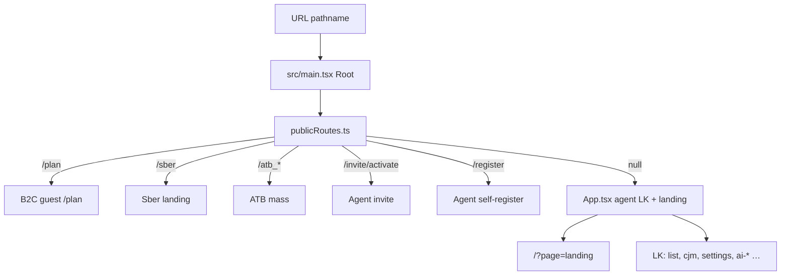

# PFP Frontend — карта для ИИ-агентов

Этот файл — **первая точка входа** для Cursor / Claude / любого coding agent в репозитории партнёра.

**Стек:** React 19 + TypeScript + Vite SPA. **Роутинг:** без react-router — public paths в `src/main.tsx`, agent LK через state в `src/App.tsx`.

**Handoff-ветка (read-only для партнёров):** `partner-handoff` — клонировать `--single-branch`, **не пушить** в наш репо. См. [`README.md`](README.md), [`docs/PARTNER_GIT_ACCESS.md`](docs/PARTNER_GIT_ACCESS.md).

---

## С чего начать

| Шаг | Документ |
|-----|----------|
| 1. Общая архитектура и lanes | [`docs/PARTNER_AI_ONBOARDING.md`](docs/PARTNER_AI_ONBOARDING.md) |
| 2. **Свой project_key → наш API** | [`docs/PARTNER_PROJECT_KEY_SETUP.md`](docs/PARTNER_PROJECT_KEY_SETUP.md) + [`.env.partner.example`](.env.partner.example) |
| 3. Guest B2C `/plan` white-label | [`docs/B2C_PLAN_HANDOFF.md`](docs/B2C_PLAN_HANDOFF.md) |
| 3. API контракты | [`api_docs/`](api_docs/) — см. таблицу ниже |
| 4. Env и деплой | [`.env.example`](.env.example), [`docs/DEPLOY_YANDEX.md`](docs/DEPLOY_YANDEX.md) |

**Полный runbook для партнёра:** [`docs/PARTNER_AI_ONBOARDING.md`](docs/PARTNER_AI_ONBOARDING.md)  
**Git (read-only clone):** [`docs/PARTNER_GIT_ACCESS.md`](docs/PARTNER_GIT_ACCESS.md)

---

## Lanes (ветки продукта в одном репо)

Один репозиторий, **несколько независимых продуктовых полос**. Перед правкой определи lane и **не ломай соседние**.

| Lane | URL | Entry | Auth | Cursor agent |
|------|-----|-------|------|--------------|
| **Landing** | `/`, `/?page=landing` | `App.tsx` → `LandingPage.tsx` | Public | [`landing`](.cursor/agents/landing.md) |
| **Agent LK** | `/` после login | `App.tsx` | Agent JWT `localStorage.token` | [`agent-lk`](.cursor/agents/agent-lk.md), UI: [`lk-ui-agent`](.cursor/agents/lk-ui-agent.md) |
| **B2C guest `/plan`** | `/plan`, `/plan/` | `B2cGuestPlanPage.tsx` | Guest JWT отдельно | [`b2c`](.cursor/agents/b2c.md) |
| **Sber** | `/sber` | `SberLandingPage.tsx` | CTAs → login | [`sber`](.cursor/agents/sber.md) |
| **ATB mass** | `/atb_mass`, `/atb_bank` | `AtbMassEntryPage.tsx` | Agent login | [`atb-mass`](.cursor/agents/atb-mass.md) |
| **Agent onboarding** | `/invite/activate`, `/register` | invite/register pages | Public → JWT | [`onboarding-agent`](.cursor/agents/onboarding-agent.md) |
| **Partner widgets** | `/npf`, `/rostech` (static) | `partner-widgets/` | Widget `X-Project-Key` | см. [`partner-widgets/constructor-chat/README.md`](partner-widgets/constructor-chat/README.md) |

**Архитектор репо (любая задача):** [`.cursor/agents/repo-architecture.md`](.cursor/agents/repo-architecture.md)

---

## API — где что лежит

**Base URL:** `VITE_API_BASE_URL` (обычно `https://…/api`). Конфиг: [`src/api/config.ts`](src/api/config.ts).

**Multi-tenant:** почти все запросы несут `X-Project-Key`. Default: [`src/api/projectKey.ts`](src/api/projectKey.ts) — партнёр задаёт **`VITE_PARTNER_PROJECT_KEY`** в `.env` (см. [`.env.partner.example`](.env.partner.example)). B2C guest — также query `?project_key=` → sessionStorage.

| Клиент | Файл | Префикс | Auth | Для чего |
|--------|------|---------|------|----------|
| Agent LK (основной) | [`src/api/agentLkApi.ts`](src/api/agentLkApi.ts) | `/api/pfp` | Agent JWT | Клиенты, продукты, PDF, AI B2C admin, CRM, invites |
| Клиент / расчёт | [`src/api/clientApi.ts`](src/api/clientApi.ts) | `/api` | Agent JWT | CRUD клиента, calculate, risk profile, отчёты агента |
| B2C guest | [`src/api/b2cApi.ts`](src/api/b2cApi.ts) | `/api` | `X-Project-Key` + guest JWT | Referral, calculate, register-client, guest reports |
| B2C AI orchestrator | [`src/api/b2cOrchestratorApi.ts`](src/api/b2cOrchestratorApi.ts) | `/api` | Key + guest JWT | SSE `POST /my/ai-b2c/chat/dynamic/stream` |
| Auth / invite | [`src/api/authApi.ts`](src/api/authApi.ts) | `/api/auth` | Mixed | Login, register, Finam ID, `/auth/me` |
| CRM | [`src/api/crmApi.ts`](src/api/crmApi.ts) | `/api/pfp/crm` | Agent JWT | Dashboard, commission |
| Resolut | agent LK + yaml | `/api/pfp` | Agent JWT | [`resolut-pfp-lk`](.cursor/agents/resolut-pfp-lk.md) |

### OpenAPI / human briefs (`api_docs/`)

| Документ | Lane |
|----------|------|
| [`agent_lk.yaml`](api_docs/agent_lk.yaml) + [`AGENT_LK_API.md`](api_docs/AGENT_LK_API.md) | Agent LK |
| [`b2c_lk.yaml`](api_docs/b2c_lk.yaml) | B2C guest / client |
| [`aiB2c.yaml`](api_docs/aiB2c.yaml) + [`AI_B2C_API_FRONTEND.md`](api_docs/AI_B2C_API_FRONTEND.md) | AI B2C orchestrator + LK admin |
| [`b2c_plan_orchestrator_frontend.md`](api_docs/b2c_plan_orchestrator_frontend.md) | SSE orchestrator на `/plan` |
| [`pfp_resolut.yaml`](api_docs/pfp_resolut.yaml) | Resolut продукты |
| [`PDFsettings.yaml`](api_docs/PDFsettings.yaml) | PDF report settings в LK |

---

## Три разных «AI» продукта (не путать!)

| Продукт | Где живёт | API / конфиг |
|---------|-----------|--------------|
| **AI B2C site** (`/plan` orchestrator) | `B2cGuestPlanPage`, `useB2cPlanOrchestrator` | `b2cOrchestratorApi`, `aiB2c.yaml`; флаг `VITE_B2C_PLAN_ORCHESTRATOR=1` или `?orchestrator=1` |
| **AI B2C admin** (настройка flows в LK) | `SettingsPage.tsx` → AI B2C tab | `agentLkApi`, [`AI_B2C_SITE_ADMIN_FRONTEND_TASK.md`](docs/AI_B2C_SITE_ADMIN_FRONTEND_TASK.md) |
| **Constructor site-chat widget** | `partner-widgets/constructor-chat/` | Env `ROSTECH_PROJECT_KEY`, `RENESSANS_PROJECT_KEY`; **не** `/plan` |
| **Constructor Telegram/MAX bot** | `AiAgentPage.tsx` в LK | `agentLkApi` constructor endpoints |

---

## Cursor: agents, skills, rules

### Subagents (`.cursor/agents/`)

| Agent | Когда вызывать |
|-------|----------------|
| [`repo-architecture.md`](.cursor/agents/repo-architecture.md) | Навигация, «где что», новый партнёр, неясный scope |
| [`b2c.md`](.cursor/agents/b2c.md) | `/plan`, guest CJM, referral, client cabinet |
| [`agent-lk.md`](.cursor/agents/agent-lk.md) | ЛК агента: клиенты, PFP, settings, API |
| [`landing.md`](.cursor/agents/landing.md) | Публичный лендинг `/` |
| [`onboarding-agent.md`](.cursor/agents/onboarding-agent.md) | Invite, register, Finam ID |
| [`sber.md`](.cursor/agents/sber.md) | Lane `/sber` |
| [`atb-mass.md`](.cursor/agents/atb-mass.md) | Lane ATB |
| [`lk-ui-agent.md`](.cursor/agents/lk-ui-agent.md) | Только вёрстка LK, без API |
| [`resolut-pfp-lk.md`](.cursor/agents/resolut-pfp-lk.md) | Resolut интеграция |

### Skills (`.cursor/skills/`)

| Skill | Назначение |
|-------|------------|
| [`partner-repo/SKILL.md`](.cursor/skills/partner-repo/SKILL.md) | Старт партнёра: lane, API, запреты |
| [`b2c-plan-handoff/SKILL.md`](.cursor/skills/b2c-plan-handoff/SKILL.md) | White-label `/plan` |
| [`pdf-report-settings-lk/SKILL.md`](.cursor/skills/pdf-report-settings-lk/SKILL.md) | PDF settings в LK |

### Rules (`.cursor/rules/`)

| Rule | Scope |
|------|-------|
| [`repo-architecture.mdc`](.cursor/rules/repo-architecture.mdc) | **alwaysApply** — lanes, API map, запреты |
| [`b2c-plan-handoff.mdc`](.cursor/rules/b2c-plan-handoff.mdc) | globs `src/components/b2c/**`, `/plan` |
| [`pdf-report-settings-lk.mdc`](.cursor/rules/pdf-report-settings-lk.mdc) | PDF settings |

---

## JWT — три разных токена

| Токен | Storage | Lane |
|-------|---------|------|
| Agent JWT | `localStorage.token` | Agent LK |
| Guest B2C JWT | `client_token` ([`clientB2cAuth.ts`](src/utils/clientB2cAuth.ts)) | `/plan` reports |
| Client B2C JWT | `client_token` после register-client | `/my/plan` (future) |

**Правило:** guest/client JWT **никогда** не затирает agent `localStorage.token`.

---

## Деплой и окружения

| Окружение | Домен | Назначение |
|-----------|-------|------------|
| Yandex prod | `family-office.bank-future.com` | Landing, `/plan`, `/sber`, ATB |
| Vercel staging | `pfp-front-ver3.vercel.app` | Agent LK (+ API proxy в [`vercel.json`](vercel.json)) |

Партнёр деплоит **свой** `dist/` на свой CDN. Шаблон: [`docs/DEPLOY_YANDEX.md`](docs/DEPLOY_YANDEX.md). Для `/plan` обязателен URL **`/plan/` со слэшем**.

---

## Типичные задачи партнёра → куда идти

| Задача | Старт |
|--------|-------|
| White-label guest `/plan` | `docs/B2C_PLAN_HANDOFF.md` + agent `b2c` |
| Прикрутить свой `project_key` | `VITE_PARTNER_PROJECT_KEY` в `.env` — [`PARTNER_PROJECT_KEY_SETUP.md`](docs/PARTNER_PROJECT_KEY_SETUP.md) |
| AI-чат на `/plan` | `docs/B2C_PLAN_ORCHESTRATOR_FRONTEND_TASK.md`, `b2cOrchestratorApi` |
| Настроить flows в LK | `docs/AI_B2C_SITE_ADMIN_FRONTEND_TASK.md`, agent `agent-lk` |
| Embed chat на свой сайт | `partner-widgets/constructor-chat/README.md` |
| Свой лендинг | agent `landing`, `src/pages/LandingPage.tsx`, `src/content/` |
| Полный LK агента | agent `agent-lk`, `api_docs/agent_lk.yaml` |

---

## Запреты (для всех lanes)

- Не коммитить `.env`, ключи CDN, секреты.
- Не менять Sber / ATB / agent LK, если задача про `/plan` (и наоборот).
- Не пушить в `main` без явной договорённости.
- Не смешивать три AI-продукта (см. таблицу выше).
