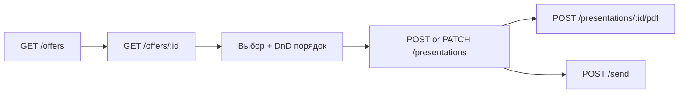

# Content Factory — задачи для фронта ЛК агента

**Обновлено:** 2026-07-18  
**Бэкенд:** готов (`/api/pfp/content-factory/*`)  
**Спеки:** `agent_lk.yaml` (тег **Content Factory**), схемы — `content-factory.yaml`

---

## Зачем

В админке уже публикуют HTML-офферы (A4, продуктовые материалы). Агент в ЛК:

1. Смотрит **каталог** опубликованных материалов
2. Открывает **превью** каждого оффера
3. Собирает **презентацию** (deck) из нескольких офферов в нужном порядке
4. Генерит **PDF** и/или шлёт клиенту на **email**

Реферальные ссылки в PDF получают `utm_agent` **на бэкенде** — фронт utm не подставляет.

---

## Auth (как везде в ЛК)

```http
Authorization: Bearer <jwt>
x-project-key: pk_…
```

- Роли: `agent`, `admin`, `super_admin`
- Для presentations в JWT нужен **`agentId`**
- Base URL: `/api`

---

## Экраны

### 1. Каталог материалов

**`GET /api/pfp/content-factory/offers`**

Light-карточки **без HTML**:

```json
[
  {
    "id": 12,
    "title": "НСЖ для семьи",
    "kind": "product",
    "brief": "…",
    "cta_label": "Оформить",
    "published_at": "2026-07-14T10:00:00.000Z",
    "expires_at": null,
    "base_template_id": "finam-a4-portrait-light",
    "page_count": 1
  }
]
```

UI: сетка/список карточек, кнопка «Добавить в презентацию», переход в превью.

---

### 2. Превью одного оффера

**`GET /api/pfp/content-factory/offers/:id`**

```json
{
  "id": 12,
  "title": "…",
  "cta_url_base": "https://…",
  "cta_label": "Оформить",
  "preview_html": "<!DOCTYPE html>…"
}
```

- **`preview_html`** — CTA уже подставлен, **utm нет**
- **`generated_html` не приходит** — только `preview_html`
- Превью:

```tsx
<iframe
  srcDoc={offer.preview_html}
  sandbox="allow-same-origin"
  title={offer.title}
  className="w-full min-h-[80vh] border-0"
/>
```

Не используйте `iframe src=URL` — JWT в iframe не прокинешь.

---

### 3. Конструктор презентации (deck)

Пользователь выбирает офферы и **меняет порядок** (drag-and-drop).

Порядок = **индекс в массиве `offer_ids`**, не отдельное поле `order`.

**Создать:**

```http
POST /api/pfp/content-factory/presentations
Content-Type: application/json

{
  "title": "Подборка для Иванова",
  "offer_ids": [12, 5, 8],
  "recipient_client_id": 456
}
```

**Обновить порядок / состав:**

```http
PATCH /api/pfp/content-factory/presentations/:id

{
  "offer_ids": [8, 12, 5],
  "title": "Новое название"
}
```

**Ответ** (create / get / patch / list):

```json
{
  "id": 1,
  "title": "Подборка для Иванова",
  "offer_ids": [12, 5, 8],
  "offers": [
    { "id": 12, "title": "…", "preview_html": "…" },
    { "id": 5, "title": "…", "preview_html": "…" },
    { "id": 8, "title": "…", "preview_html": "…" }
  ],
  "status": "draft",
  "recipient_client_id": 456,
  "email_subject": null,
  "email_body": null
}
```

- **`offers[]`** уже в порядке `offer_ids` — используй для превью слайдов deck
- Превью deck: табы или вертикальный список iframe по `offers[i].preview_html`

**Список презентаций агента:** `GET /api/pfp/content-factory/presentations`

---

### 4. PDF

```http
POST /api/pfp/content-factory/presentations/:id/pdf
```

JSON-ответ:

```json
{
  "presentation": { … },
  "pdf_base64": "JVBERi0…",
  "utm_agent": "12345",
  "content_type": "application/pdf"
}
```

- **`utm_agent`** — для информации; utm уже вшит в PDF на бэке
- Скачать файл: тот же POST с **`?download=1`** → raw PDF (не JSON)
- Показать в UI: `Blob` из base64 или window.open на download URL

```ts
const bytes = Uint8Array.from(atob(pdf_base64), (c) => c.charCodeAt(0));
const blob = new Blob([bytes], { type: 'application/pdf' });
const url = URL.createObjectURL(blob);
```

**Важно:** utm добавляется **только в PDF**, не в `preview_html`.

---

### 5. Email клиенту

**Черновик текста:**

```http
POST /api/pfp/content-factory/presentations/:id/email-draft
```

→ заполняет `email_subject`, `email_body` в presentation.

**Отправка:**

```http
POST /api/pfp/content-factory/presentations/:id/send
Content-Type: application/json

{ "to": "client@example.com" }
```

`to` опционален, если задан `recipient_client_id` с email в карточке клиента.

---

## Flow (mermaid)



---

## Ошибки

| HTTP | Что показать |
|------|----------------|
| 400 | Невалидный `offer_ids` (оффер не published / expired) |
| 404 | Оффер или презентация не найдены |
| 400 на presentations | Нет `agentId` в JWT |

---

## Не делать

- Прямые вызовы IDE API — только через pfp-api
- Подставлять `utm_agent` в preview / iframe
- Тянуть `generated_html` — его нет в agent API
- Редактировать HTML оффера в ЛК (только админка)

---

## TypeScript (черновик)

```ts
export interface ContentFactoryOfferListItem {
  id: number;
  title: string;
  kind: string;
  brief: string | null;
  cta_label: string | null;
  published_at: string | null;
  expires_at: string | null;
  base_template_id: string;
  page_count: number;
}

export interface ContentFactoryOfferDetail extends ContentFactoryOfferListItem {
  cta_url_base: string | null;
  preview_html: string | null;
}

export interface ContentFactoryOfferDeckItem extends ContentFactoryOfferListItem {
  preview_html: string | null;
}

export interface AgentPresentation {
  id: number;
  title: string;
  offer_ids: number[];
  offers: ContentFactoryOfferDeckItem[];
  status: 'draft' | 'ready' | 'sent';
  recipient_client_id: number | null;
  email_subject: string | null;
  email_body: string | null;
  created_at: string;
  updated_at: string;
}
```

---

## Связанные файлы в `api_docs/`

| Файл | Назначение |
|------|------------|
| `agent_lk.yaml` | OpenAPI paths для ЛК (тег Content Factory) |
| `content-factory.yaml` | Полные схемы request/response |
| `AGENT_LK_API.md` | Общий обзор API ЛК |

Админка (создание офферов через IDE) — отдельный контур, в ЛК агента **не входит**.
