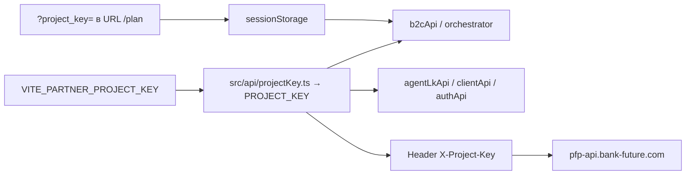

# Partner setup — свой `project_key`, API BankFuture

**Сценарий:** партнёр хостит **свой фронт**, все запросы идут на **наш сервер** `pfp-api.bank-future.com`.  
Данные изолированы по **`project_key`** (и `project_id` на бэке).

**Шаблон env:** [`.env.partner.example`](../.env.partner.example)  
**Runbook:** [`PARTNER_AI_ONBOARDING.md`](./PARTNER_AI_ONBOARDING.md)  
**Индекс для ИИ:** [`AGENTS.md`](../AGENTS.md)

---

## 1. Что выдаёт BankFuture (запросить у нас)

| Что | Пример | Зачем |
|-----|--------|-------|
| `project_key` | `pk_a1b2c3…` | Заголовок `X-Project-Key` на **каждом** API-запросе |
| `project_id` | `42` | Некоторые LK-эндпоинты, Resolut, PDF — см. `getRuntimeProjectId()` |
| CORS whitelist | `https://partner-domain.com` | Браузер с **чужого** origin бьёт в наш API |
| Agent accounts (если LK) | login/password | ЛК агента партнёра |
| AI B2C flows (если orchestrator) | настройка в LK / backend | SSE `/my/ai-b2c/chat/dynamic/stream` |

**Шаблон письма backend:**

```text
Тема: Partner tenant — {Название партнёра}

Нужно для white-label фронта:
1. project_key (pk_…)
2. project_id (число)
3. CORS: https://{partner-domain.com} (+ https://staging.{…} если есть)
4. [опционально] agent accounts для LK
5. [опционально] AI B2C flows для /plan orchestrator

Фронт деплоится партнёром на свой CDN.
API: https://pfp-api.bank-future.com/api
Lane: guest /plan (+ landing при необходимости)
```

---

## 2. Что настраивает партнёр на фронте

### Минимальный `.env`

```env
VITE_SITE_URL=https://partner-domain.com
VITE_API_BASE_URL=https://pfp-api.bank-future.com/api
VITE_PARTNER_PROJECT_KEY=pk_…
VITE_PARTNER_PROJECT_ID=42
```

Копировать из [`.env.partner.example`](../.env.partner.example).

### Как key попадает в запросы



| Способ | Когда использовать |
|--------|-------------------|
| **`VITE_PARTNER_PROJECT_KEY`** | Рекомендуется — один tenant на build, не надо править `.ts` |
| Query `?project_key=` | Override в ссылке; сохраняется в sessionStorage для `/plan` |
| Правка `projectKey.ts` | Legacy / если env недоступен на CI |

Код: [`src/api/projectKey.ts`](../src/api/projectKey.ts)

---

## 3. Архитектура «их фронт — наш API»

```
┌─────────────────────────┐         ┌──────────────────────────────┐
│  partner-domain.com     │  HTTPS  │  pfp-api.bank-future.com     │
│  (CDN партнёра)         │ ──────► │  /api/*                      │
│  dist/ из npm run build │         │  tenant = X-Project-Key      │
└─────────────────────────┘         └──────────────────────────────┘
         │                                       │
         │  Origin: partner-domain.com           │  project_key → свои
         │  X-Project-Key: pk_partner_…          │  agents, clients, PDF
         └───────────────────────────────────────┘
```

**Важно:**

- Партнёр **не** деплоит API и **не** форкает backend.
- `VITE_API_BASE_URL` всегда указывает на **наш** хост (prod или staging по договорённости).
- `VITE_SITE_URL` — **домен партнёра** (SEO, canonical, ссылки в PDF если бэк их подставляет).

### CORS

Если фронт на `https://partner.com`, а API на `https://pfp-api.bank-future.com` — браузер требует CORS.  
**Без whitelist домена партнёра запросы упадут** (preflight / blocked). Это настраивает **backend BankFuture**, не партнёр.

### Staging API

Если дали staging URL — только в `.env` партнёра:

```env
VITE_API_BASE_URL=https://pfp-api-staging.bank-future.com/api
```

Prod и staging **разные** `project_key` — уточнять у backend.

---

## 4. Ссылки для агентов партнёра

### Guest `/plan` (основной кейс)

```text
https://partner-domain.com/plan/?ref={AGENT_REF}&project_key={pk_partner}
```

Если `VITE_PARTNER_PROJECT_KEY` задан при build — `project_key` в URL **можно не передавать**:

```text
https://partner-domain.com/plan/?ref={AGENT_REF}
```

`ref` — код агента из LK (client-invite-link). Без `ref` calculate сохранит расчёт, но lead в CRM может не привязаться.

### Redirect с корня (опционально)

`/?ref=…` → `/plan/` — [`clientB2cAttribution.ts`](../src/utils/clientB2cAttribution.ts).  
Работает если партнёр не вырезал redirect из `main.tsx`.

---

## 5. Проверка (smoke checklist)

### Build

```bash
cp .env.partner.example .env
# заполнить VITE_* 
npm install
npm run build
# dist/ → свой CDN
```

### Browser

1. Открыть `/plan/` **со слэшем**
2. DevTools → Network → любой запрос к API:
   - URL: `https://pfp-api.bank-future.com/api/…`
   - Request header: `X-Project-Key: pk_partner_…`
3. Пройти CJM → `POST /client/calculate` → 200
4. Если email + ref → в ответе `guest_token` → открыть HTML/PDF отчёт
5. Если CORS error → написать нам, добавить домен в whitelist

### Типичные ошибки

| Симптом | Причина |
|---------|---------|
| CORS blocked | Домен не в whitelist backend |
| 401 / 403 на API | Неверный `project_key` или ключ не активирован |
| `ref` не работает | Агент не из **этого** tenant |
| Потерян `ref` после reload | URL без `/plan/` слэша на CDN |
| Отчёт не открывается | Нет email на шаге 1 или нет `guest_token` |

---

## 6. Lanes и project_key

| Lane | Нужен LK? | project_key |
|------|-------------|-------------|
| Guest `/plan` | Нет (guest) | `VITE_PARTNER_PROJECT_KEY` или URL |
| Landing `/` | Нет | Только если CTA бьёт в API |
| Agent LK | Да (agent JWT) | `VITE_PARTNER_PROJECT_KEY` на все `/api/pfp` |
| Widget embed | Нет | Отдельный env в `partner-widgets/` |

Партнёр с **только `/plan`** не обязан поднимать LK — но **агенты** должны существовать в **нашем** backend под их `project_key`, иначе `ref` invalid.

---

## 7. AI orchestrator (если нужен)

1. Backend + LK admin настраивают flows под **их** `project_key`
2. На фронте партнёра:

```env
VITE_B2C_PLAN_ORCHESTRATOR=1
```

или URL `?orchestrator=1` для теста.

Док: [`B2C_PLAN_ORCHESTRATOR_FRONTEND_TASK.md`](./B2C_PLAN_ORCHESTRATOR_FRONTEND_TASK.md)

---

## 8. Безопасность

- `project_key` — **публичный** tenant id (как Firebase API key). Защита данных — на backend по key + auth.
- **Не** коммитить `.env` в git.
- Agent JWT / guest_token — только `localStorage`, не в URL.
- Webhook URL (`VITE_LANDING_LEAD_WEBHOOK`) — секрет CRM партнёра.

---

## 9. Контакты / эскалация

| Проблема | Куда |
|----------|------|
| Новый tenant, key, CORS | Backend BankFuture |
| AI flows, orchestrator stages | Backend + [`AI_B2C_SITE_ADMIN_*`](./AI_B2C_SITE_ADMIN_FRONTEND_TASK.md) |
| PDF шаблоны | Backend + `PDFsettings.yaml` |
| Баг фронта handoff | Обновление ветки `partner-handoff` от BankFuture |

---

## Связанные файлы

| Файл | Роль |
|------|------|
| [`src/api/projectKey.ts`](../src/api/projectKey.ts) | Resolves key/id from env |
| [`src/api/config.ts`](../src/api/config.ts) | API base URL |
| [`src/utils/clientB2cAttribution.ts`](../src/utils/clientB2cAttribution.ts) | `ref` + URL key |
| [`.env.partner.example`](../.env.partner.example) | Copy-paste template |
| [`docs/B2C_PLAN_HANDOFF.md`](./B2C_PLAN_HANDOFF.md) | White-label `/plan` files |
